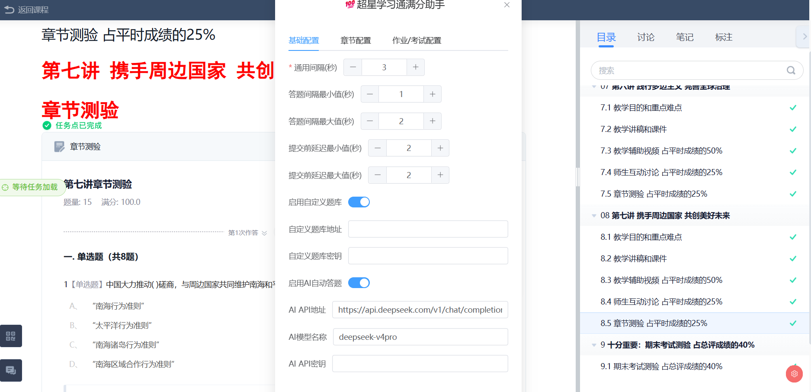
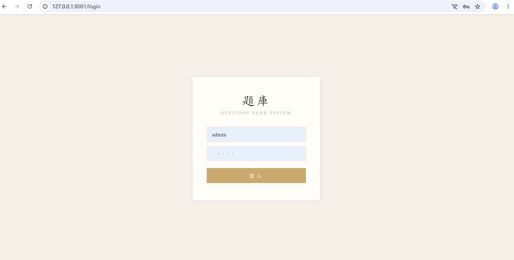
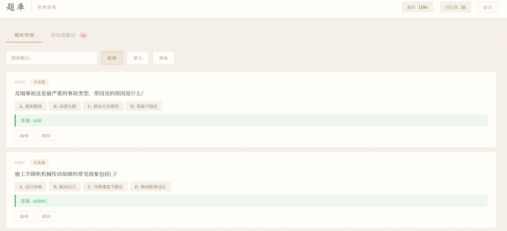
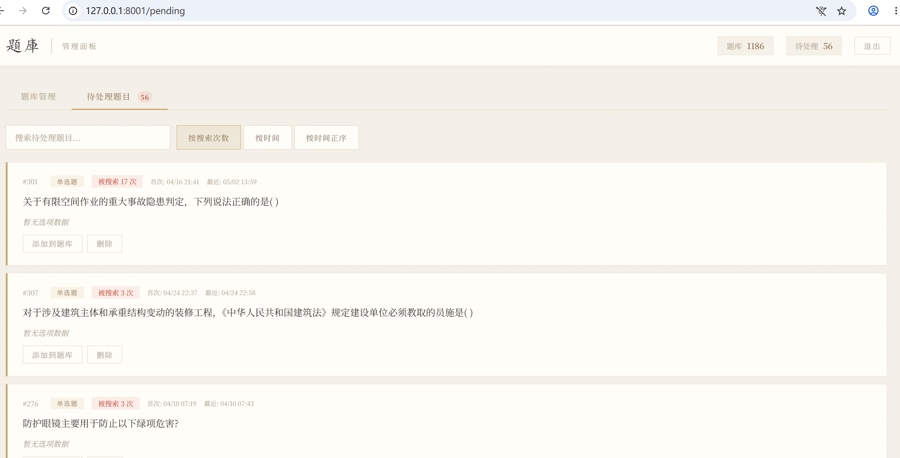

# 超星学习通自动化系统

超星学习通（Chaoxing）在线学习平台自动化工具，基于 [超星学习通满分助手](https://greasyfork.org/zh-CN/scripts/436994) 改造，新增自定义题库服务器和 AI 解题功能，包含用户脚本和服务端题库 API 两部分。

### 相比原版的改进

- 新增自定义题库服务器，支持对接自建 API 查询答案
- 新增 AI 解题功能，支持接入 DeepSeek 等大模型
- 保留原版全部功能：任务点自动跳转、章节测验、作业、考试、全网搜索答案、视频/音频全自动静音播放

## 使用建议

本系统提供两种答题方式，适用于不同场景：

| | AI 解题 | 题库服务器 |
|--|---------|-----------|
| **适用人群** | 个人学生 | 机构、培训中心 |
| **正确率** | 一般（依赖大模型能力） | 高（题目与答案一一对应） |
| **部署成本** | 无需部署，配置 API Key 即可 | 需要搭建服务器并导入题库 |
| **题目覆盖** | 广泛，但冷门题目可能出错 | 有限，仅限已导入的题目 |

- **个人学生**：直接使用 AI 解题即可，配置 DeepSeek 等 API Key 后脚本会自动调用大模型生成答案，无需额外部署。
- **机构/批量场景**：如果对正确率有严格要求（如批量刷题、机构统一管理），建议搭建题库服务器，将标准答案导入数据库，确保每道题都能精确匹配。

## 效果展示

**脚本配置面板** - 在学习通页面中打开 Tampermonkey 设置，配置题库地址和 AI API：



**题库管理后台登录** - 访问 `http://localhost:8002` 进入管理界面：



**题库管理面板** - 登录后可查看、搜索、新增、导入、导出题目：



**待处理题目** - 未匹配到答案的题目会自动归入待处理列表，支持手动补充答案：



## 项目结构

```
├── 学习通脚本.js              # Tampermonkey 用户脚本（自动答题、视频播放、任务点导航）
├── tiku/                      # 题库服务器
│   ├── main.py                # 服务入口
│   ├── app/                   # FastAPI 应用（路由、数据库、中间件）
│   │   ├── config.py          # 配置常量
│   │   ├── database.py        # SQLite 异步数据库
│   │   ├── matching.py        # 题目匹配逻辑
│   │   ├── middleware.py       # 限流中间件
│   │   ├── schemas.py         # Pydantic 数据模型
│   │   └── routes/            # API 路由
│   ├── frontend/              # Vue 3 管理界面（Vite + Element Plus）
│   ├── templates/             # 旧版 HTML 管理界面
│   ├── tiku.json              # 题库数据
│   ├── questions.db           # SQLite 数据库
│   ├── requirements.txt       # Python 依赖
│   └── start.sh               # 启动脚本
└── CLAUDE.md                  # 项目说明
```

## 快速开始

### 1. 安装用户脚本

本脚本需要在 [Tampermonkey（篡改猴）](https://www.tampermonkey.net/) 浏览器扩展上运行，以下是详细安装教程：

**第一步：安装 Tampermonkey**

1. 打开 [Tampermonkey 官网](https://www.tampermonkey.net/)
2. 点击对应你浏览器的安装按钮（支持 Chrome、Firefox、Edge、Safari 等）
3. 在浏览器扩展商店中确认安装

**第二步：添加脚本**

1. 点击浏览器右上角的 Tampermonkey 图标
2. 选择「添加新脚本...」
3. 清空编辑器中的默认内容
4. 将 `学习通脚本.js` 的全部内容粘贴进去
5. 按 `Ctrl + S` 保存

**第三步：使用脚本**

1. 打开超星学习通网站并登录
2. 进入课程页面，脚本将自动运行
3. 点击浏览器右上角 Tampermonkey 图标可查看脚本状态和配置

### 2. 启动题库服务器

```bash
cd tiku

# 创建虚拟环境
python -m venv venv
source venv/bin/activate  # Windows: venv\Scripts\activate

# 安装依赖
pip install -r requirements.txt

# 启动服务（默认端口 8002）
python main.py
```

或使用启动脚本：

```bash
./start.sh              # 默认端口 8002
./start.sh 8002         # 指定端口
./start.sh 8002 true    # 高性能模式（多工作进程）
```

启动后访问：
- 管理界面：`http://localhost:8002`
- API 接口：`http://localhost:8002/api/search`

### 3. 前端开发

```bash
cd tiku/frontend
npm install
npm run dev      # 开发模式
npm run build    # 构建到 tiku/static/
```

## API 接口

### 查询答案

```
POST /api/search
Content-Type: application/json
```

**请求参数：**

| 字段       | 类型   | 说明                     |
| ---------- | ------ | ------------------------ |
| `question` | string | 题目文本                 |
| `type`     | string | 题目类型（0-7）          |
| `key`      | string | API 密钥（可选）         |

**题目类型：**

| 值 | 类型     |
| -- | -------- |
| 0  | 单选题   |
| 1  | 多选题   |
| 2  | 填空题   |
| 3  | 判断题   |
| 4  | 简答题   |
| 5  | 名词解释 |
| 6  | 论述题   |
| 7  | 计算题   |

**响应示例：**

```json
{
  "code": -1,
  "msg": "查询成功",
  "data": {
    "answer": "A#B#C",
    "num": "1000",
    "usenum": "100"
  }
}
```

**答案格式：**
- 单选/判断题：直接返回答案文本（如 `"36V"`、`"正确"`）
- 多选题：多个答案用 `#` 分隔（如 `"A#B#C"`）
- 填空题：多个空用 `|` 分隔

## 配置说明

### 服务器环境变量

| 变量        | 默认值         | 说明                 |
| ----------- | -------------- | -------------------- |
| `PORT`      | `8002`         | 服务端口             |
| `API_KEY`   | `your_api_key` | API 认证密钥         |
| `WORKERS`   | `1`            | 工作进程数           |

### 脚本配置

在脚本配置面板中可设置：
- **启用自定义题库**：开启后优先使用自定义接口
- **自定义题库地址**：填入 API URL（如 `http://localhost:8002/api/search`）
- **自定义题库密钥**：填入服务器要求的 API 密钥


## 技术栈

**用户脚本：** Vue 3 / Pinia / Element Plus（内嵌），Tampermonkey GM_* API

**题库服务器：**
- 后端：Python / FastAPI / uvicorn / aiosqlite
- 前端：Vue 3 / Element Plus / Vite
- 数据库：SQLite

## 免责声明

1. 本项目仅供**学习交流与技术研究**使用，严禁用于任何商业用途或违反平台服务条款的行为。
2. 使用本工具产生的一切后果由使用者自行承担，开发者不承担任何责任。
3. 本项目不保证功能的持续可用性，超星学习通平台可能更新反作弊机制导致脚本失效。
4. 请遵守超星学习通平台的用户协议及相关法律法规，合理使用本工具。
5. 本项目仅供学习交流使用。
